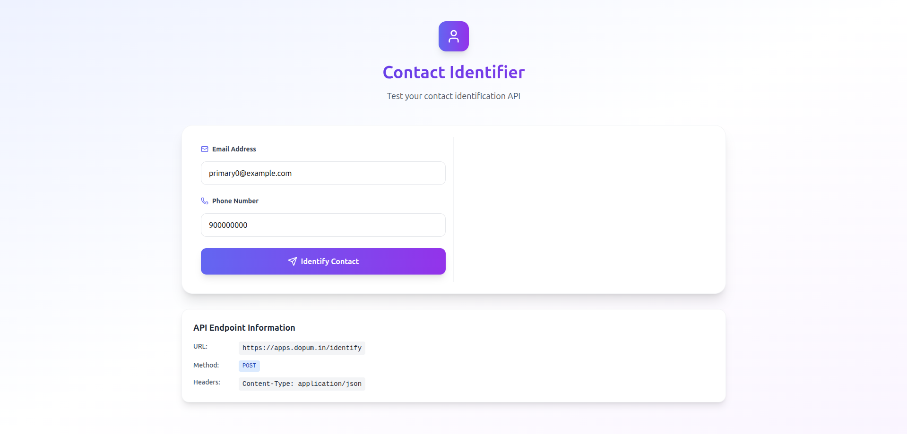

# Bitespeed Identity Reconciliation

This project implements the **Identity Reconciliation Backend Task** for Bitespeed. The goal is to track and unify customer identities using their `email` and `phoneNumber`.

## 🛠 Tech Stack

- Node.js
- Express
- PostgreSQL
- Knex.js (for DB operations)

---

## 🖼️ Sample UI



---

## 📁 Project Structure

```

.
├── index.js                # Main server entry point
├── knexfile.js             # Knex configuration
├── .env                    # Environment variables
├── package.json
├── README.md
├── migrations/             # Database schema migrations
│   └── 20250604000000_create_contacts.js
├── seeds/                  # Dummy data seed files
│   └── 01_dummy_contacts.js
├── src/
│   ├── db.js               # Knex instance (rename from db.js.js)
│   └── routes/
│       └── identity.js     # /identify route 
└── postman.json            # Postman collection

````

---

## 🧪 API Endpoint

### `POST /identify`

**Request Body:**

```json
{
  "email": "example@example.com",
  "phoneNumber": "9876543210"
}
````

**Response:**

```json
{
  "contact": {
    "primaryContatctId": 1,
    "emails": ["primary@example.com", "secondary@example.com"],
    "phoneNumbers": ["9876543210"],
    "secondaryContactIds": [2, 3]
  }
}
```

---

## 🗂 Database Schema

**Table: `contact`**

| Field          | Type               | Description                    |
| -------------- | ------------------ | ------------------------------ |
| id             | Integer (PK)       | Auto-incremented ID            |
| phoneNumber    | String (nullable)  | Phone number                   |
| email          | String (nullable)  | Email address                  |
| linkedId       | Integer (nullable) | Points to primary contact's ID |
| linkPrecedence | Enum               | `'primary'` or `'secondary'`   |
| createdAt      | Timestamp          | Auto-filled                    |
| updatedAt      | Timestamp          | Auto-filled                    |
| deletedAt      | Timestamp          | Nullable, soft-delete support  |

---

## 🧑‍💻 Local Development

### 1. Install Dependencies

```bash
npm install
```

### 2. Configure Environment

Create a `.env` file:

```env
DB_HOST=localhost
DB_USER=your_user
DB_PASSWORD=your_password
DB_NAME=your_db
DB_PORT=5432
```

### 3. Migrate & Seed

```bash
npx knex migrate:latest --knexfile knexfile.js
npx knex seed:run --knexfile knexfile.js
```

### 4. Run the Server

```bash
node index.js
```

The server will run on: `http://localhost:3000`

---

## 📦 Sample Data

Run the seed to insert **50 dummy records** (10 primary, 40 secondary) into the `contact` table.

---

## ✨ Credits

This solution was built by **Chirag** for the Bitespeed Backend Task using clean architectural practices and PostgreSQL.


